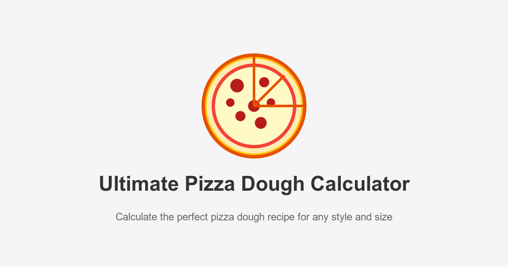

# Ultimate Pizza Dough Calculator

A modern, responsive web application for calculating perfect pizza dough recipes with precise baker's percentages.



## 🍕 Live Demo

Visit the live application: [Ultimate Pizza Dough Calculator](https://ultimatepizzadough.xyz)

## ✨ Features

- **Multiple Pizza Styles**: Neapolitan, New York, Sicilian, Detroit, Focaccia, and Custom
- **Preferment Options**: None, Poolish, Biga, Sponge, and Sourdough
- **Yeast Type Selection**: Active Dry, Instant, and Fresh yeast with automatic conversion
- **Measurement Units**: Toggle between metric (cm) and imperial (inches)
- **Responsive Design**: Works on desktop, tablet, and mobile devices
- **Dark/Light Mode**: Choose your preferred theme
- **Detailed Recipe Display**: Complete ingredient list with baker's percentages
- **Step-by-Step Instructions**: Clear method for preparing your dough
- **PWA Support**: Install as a standalone app on mobile devices

## 🛠️ Technology Stack

- **React**: UI library
- **TypeScript**: Type-safe JavaScript
- **Framer Motion**: Animations and transitions
- **Styled Components**: Styling solution
- **Vite**: Build tool
- **Google Analytics**: User interaction tracking

## 📊 Analytics

The application includes Google Analytics to track user interactions and improve the user experience. The following events are tracked:

- Page views
- Pizza style selections
- Preferment type selections
- Yeast type selections
- Unit changes (inches/centimeters)
- Theme changes (light/dark)
- Tab views (ingredients/method)
- Recipe generations
- Reset actions

## 🚀 Getting Started

### Prerequisites

- Node.js (v16 or higher)
- npm or yarn

### Installation

1. Clone the repository:
   ```bash
   git clone https://github.com/yourusername/ultimate-pizza-dough-calculator.git
   cd ultimate-pizza-dough-calculator
   ```

2. Install dependencies:
   ```bash
   npm install
   # or
   yarn install
   ```

3. Start the development server:
   ```bash
   npm run dev
   # or
   yarn dev
   ```

4. Open your browser and navigate to `http://localhost:5173`

### Building for Production

```bash
npm run build
# or
yarn build
```

The build artifacts will be stored in the `dist/` directory.

## 📱 PWA Features

The application is configured as a Progressive Web App (PWA), allowing users to install it on their devices. It includes:

- Home screen icons
- Splash screens
- Offline support
- Full-screen mode

## 🤝 Contributing

Contributions are welcome! Please feel free to submit a Pull Request.

1. Fork the repository
2. Create your feature branch (`git checkout -b feature/amazing-feature`)
3. Commit your changes (`git commit -m 'Add some amazing feature'`)
4. Push to the branch (`git push origin feature/amazing-feature`)
5. Open a Pull Request

## 📄 License

This project is licensed under the MIT License - see the LICENSE file for details.

## 🙏 Acknowledgements

- Created with ❤️ for pizza enthusiasts everywhere
- Pizza icon designed by [Your Name]
- Special thanks to the pizza community for feedback and suggestions

---

Made with passion by chakkale (and Cursor AI)
